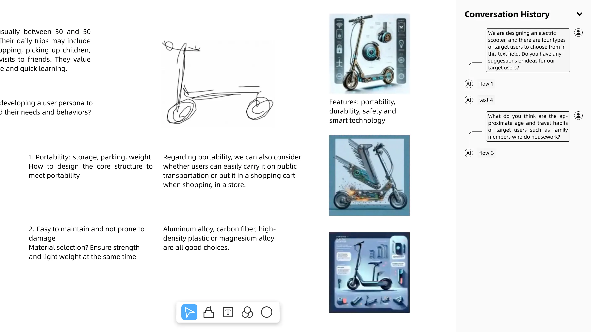
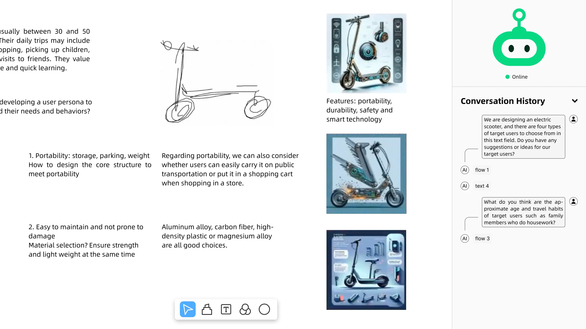

# Who: Authorship History

## General Background
You are using a creative collaboration system to collaborate with an AI collaborator to design e-scooter product concepts. Designing experience in this system is similar to Figma and Miro; the basic abilities of the AI collaborator are similar to ChatGPT, ChatGLM, and Yiyan.

## Scenario
Before producing the final concept, you decide to review the past content. The current interface you see is shown in the figure below. 

### Condition 1 (this title did not appear in the vignette)
You are using system **DesignPal**. 
In this scenario, the interface you see is shown in the figure below.

### Condition 2 (this title did not appear in the vignette)
You are using system **intCollab**. 
In this scenario, the interface you see is shown in the figure below.

<!-- <table style="margin-left: auto; margin-right: auto; margin-top: 24px;">
    <tr style="border: none;">
        <td style="border-width: 0 2px 0 0; padding-left: 0;">
            <h3 style="margin-top: 0;">Condition 1</h3>
            You are using system <b>DesignPal</b>. 
            In this scenario, the interface you see is shown in the figure below. 
            
        </td>
        <td style="border-width: 0 0 0 2px; padding-right: 0;">
            <h3 style="margin-top: 0;">Condition 2</h3>
            You are using system <b>intCollab</b>. 
            In this scenario, the interface you see is shown in the figure below. 
            
        </td>
    </tr>
</table> -->